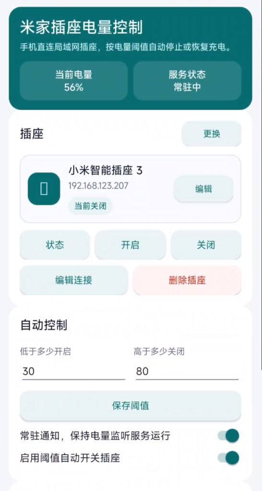
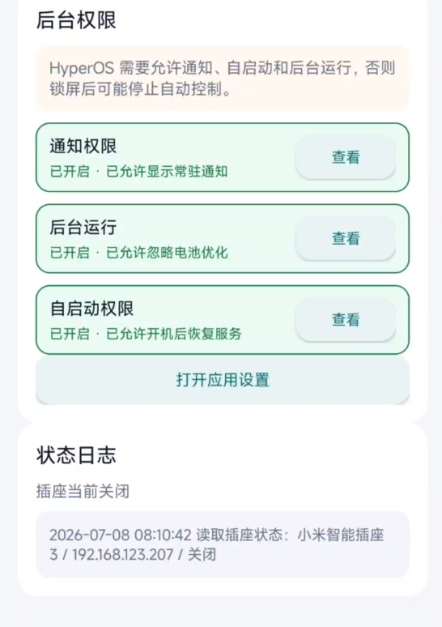

# 米家智能插座电量控制 APK

这是一个 Android APK 项目，用手机直接在局域网内控制小米智能插座 3，并根据手机电量自动开关插座。

## 来源说明

项目参考了 [Do1e/mijia-api](https://github.com/Do1e/mijia-api) 对米家设备、MIOT 属性和米家云端接口的整理。当前 APK 不依赖电脑常驻服务；核心控制逻辑由原生 Android 代码直接实现 miIO 局域网协议。

## 已实现功能

- 添加插座：填写插座名称、局域网 IP、32 位 miIO token。
- 手动控制：开启插座、关闭插座、读取插座开关状态。
- 电量读取：首页显示手机当前电量。
- 自动控制：设置低电量开启阈值、高电量关闭阈值。
- 常驻通知：单独开关前台服务，让 App 长时间保持电量监听。
- 开机恢复：启用常驻通知或自动控制后，系统重启后尝试恢复服务。
- HyperOS 适配：提供后台运行、自启动、应用设置入口。
- GitHub Actions 构建：APK 通过远端 CI 构建，不依赖本机 Java/Gradle。

## 界面截图

主界面包含当前电量、服务状态、插座控制、阈值设置和自动控制开关：



后台权限和状态日志用于确认 HyperOS / MIUI 长时间运行所需权限：



## 工作方式

手机和插座必须在同一局域网。App 使用 Android 电池广播读取手机电量，然后通过 miIO 局域网 UDP 协议控制插座。

默认适配的小米智能插座 3 参数：

| 项目 | 值 |
| --- | --- |
| 常见型号 | `cuco.plug.v3` |
| miIO 端口 | `54321/udp` |
| 开关属性 `siid` | `2` |
| 开关属性 `piid` | `1` |
| 开启 | `true` |
| 关闭 | `false` |

## Token 说明

当前 APK 需要用户手动填写插座 token。只提供插座 IP 无法从已绑定设备中直接反推出 token，因为局域网握手不会返回真实 token。

后续可以做“小米账号登录并从米家云端读取设备 token”的功能，但这会引入账号登录、云端接口加密和凭据保存等安全边界。当前版本先保持本地局域网控制，token 只保存在手机 App 本地配置中，不应提交到 GitHub。

### 获取 token 的方式

本项目不内置小米账号登录和云端 token 提取功能。用户需要自行使用可信工具获取已绑定设备的 miIO token，例如：

- 原始 Python 工具：[PiotrMachowski/Xiaomi-cloud-tokens-extractor](https://github.com/PiotrMachowski/Xiaomi-cloud-tokens-extractor)
- Web 版源码：[rankjie/xiaomi-tokens-web](https://github.com/rankjie/xiaomi-tokens-web)
- Web 版公开演示：[https://xiaomi-token-web.asd.workers.dev/](https://xiaomi-token-web.asd.workers.dev/)

使用公开托管的 token 提取工具会让小米账号凭据经过第三方服务器。更稳妥的做法是审计源码后在本机运行，或部署到自己的 Cloudflare Workers / Pages 后再使用。

安全注意事项：

- 不要把小米账号密码、设备 token、家庭网络信息写入源码、README、Issue、截图或提交记录。
- 使用 Web 工具时建议使用无痕窗口，用完后清理该站点的浏览器数据。
- 如果自行部署 Web 工具，token 获取完成后可以停用或删除对应部署。
- 如果工具要求进行小米双因素认证，应按该工具的说明处理验证码流程；不要把验证码提交到不可信页面。
- 复制到的设备 token 只应填写到 APK 本地配置中。

## 手机使用流程

1. 在路由器后台给插座固定局域网 IP。
2. 安装 APK。
3. 在 App 内填写插座名称、局域网 IP、32 位 token。
4. 点击“添加 / 保存插座”。
5. 先点击“状态”确认能读到插座开关状态。
6. 再测试“开启”和“关闭”。
7. 设置低电量开启阈值和高电量关闭阈值，例如 `40` / `80`。
8. 打开“常驻通知，保持电量监听服务运行”。
9. 打开“启用阈值自动开关插座”。
10. 在“后台权限”中允许通知、自启动和后台运行。

## HyperOS / MIUI 注意事项

在 Redmi K40 / HyperOS 3.0 / Android 16 上做过基础验证。为了长时间运行，建议手动确认：

- 允许通知，否则前台服务状态可能不可见。
- 允许自启动，否则重启后可能不会恢复服务。
- 允许后台运行或忽略电池优化，否则锁屏后可能被系统停止。

## 项目结构

```text
app/src/main/java/com/sunnyday/mijiaapk/
  AppSettings.java             本地配置读写
  BootReceiver.java            开机恢复服务
  MainActivity.java            主界面、表单、手动控制、权限入口
  MiioLanClient.java           miIO 局域网 UDP/AES 控制实现
  PlugAutomationService.java   前台服务、电量监听、阈值自动控制

.github/workflows/android-apk.yml
  GitHub Actions APK 构建流程
```

## 构建 APK

推送到 `main` 后自动构建：

```text
.github/workflows/android-apk.yml
```

也可以手动触发：

```powershell
gh workflow run android-apk.yml --repo SunnyDay00/mijia-apk --ref main
```

查看构建：

```powershell
gh run list --repo SunnyDay00/mijia-apk --workflow android-apk.yml --limit 5
gh run watch <run-id> --repo SunnyDay00/mijia-apk --exit-status
```

下载 APK：

```powershell
$run = "<run-id>"
$dir = "dist\mijia-apk-debug-$run"
New-Item -ItemType Directory -Force -Path $dir | Out-Null
gh run download $run --repo SunnyDay00/mijia-apk --name mijia-apk-debug --dir $dir
Get-FileHash -Algorithm SHA256 "$dir\app-debug.apk"
```

安装到已连接 ADB 设备：

```powershell
adb install -r "$dir\app-debug.apk"
```

## 开源许可

本项目采用 [GPL-3.0](LICENSE) 开源许可证。
